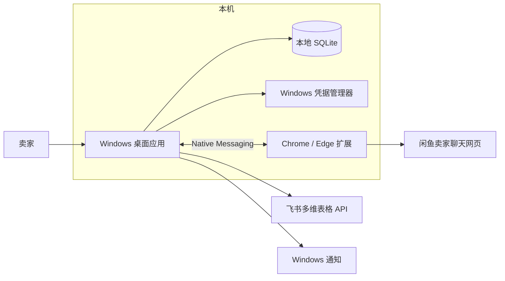
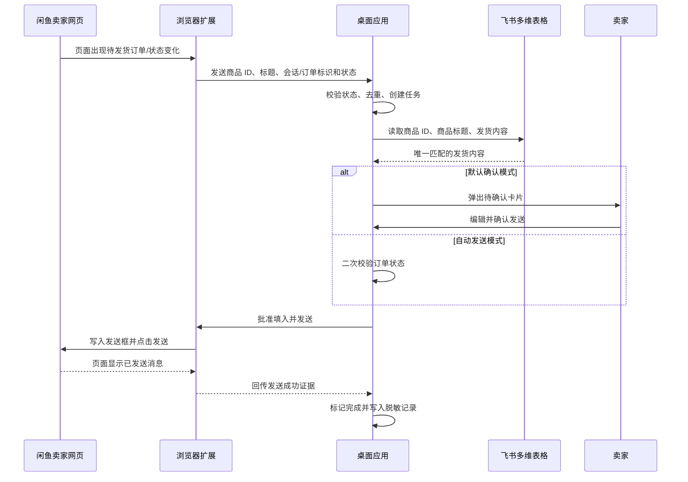
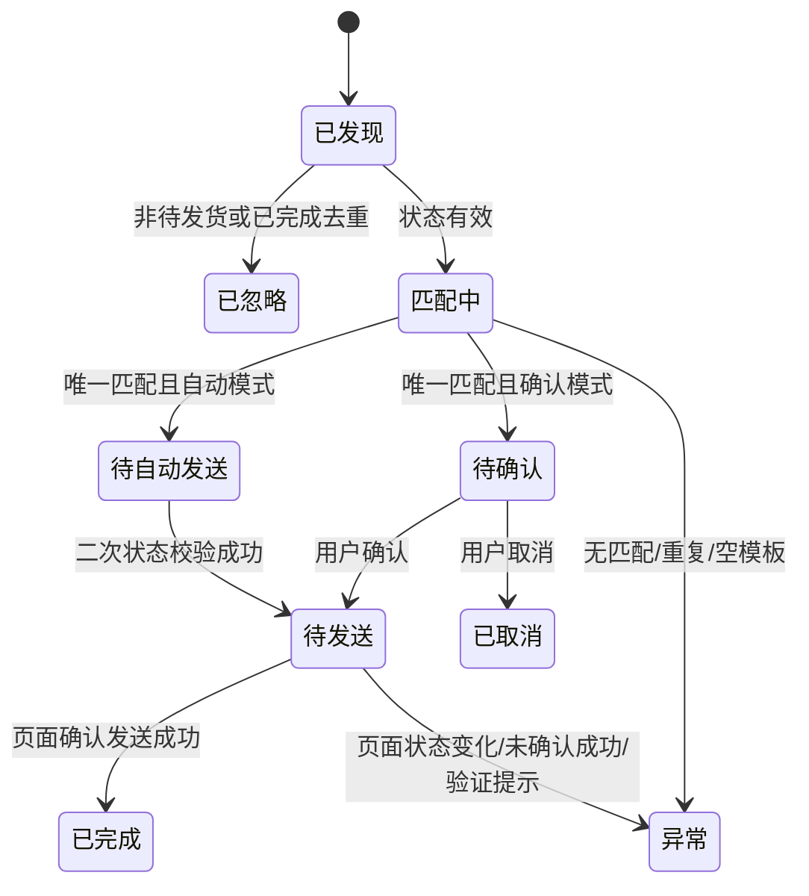
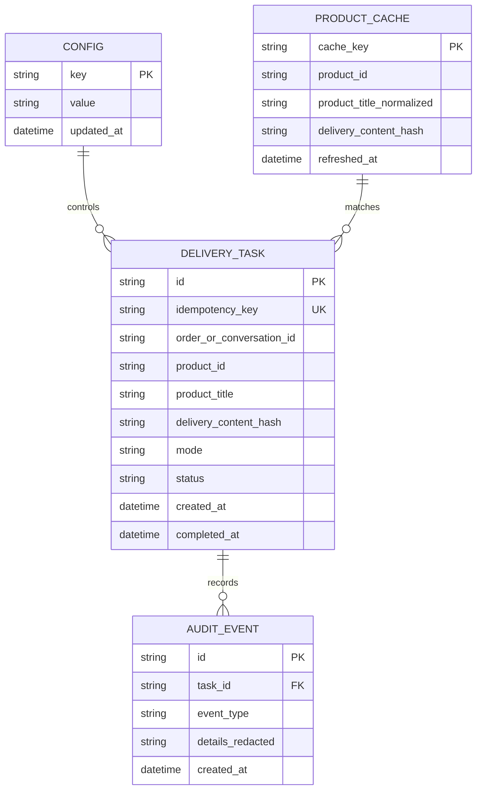
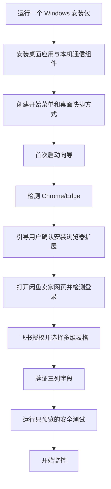

# 技术方案：闲鱼虚拟商品发货助手

## 1. 设计结论

第一版做成仅支持 Windows 的本地桌面应用，而不是云端服务。它由桌面应用和浏览器扩展组成，但对用户交付为一个 Windows 安装包。浏览器首次启用扩展时仍须由用户确认，这是 Chrome/Edge 的安全要求，不能也不应绕过。

发货匹配不调用大模型。规则为：**商品 ID 精确匹配优先；页面没有可用商品 ID 时，商品标题标准化精确匹配兜底；其余情况不发送。**

网页适配层只操作已登录的卖家网页，不抓取私有接口、不伪造网络请求、不绕过登录或验证。若未来取得闲鱼官方授权能力，只替换该适配层，其他模块无需重写。

## 2. 技术栈

| 层次 | 选型 | 说明 |
|---|---|---|
| 桌面应用 | Tauri 2 + Rust | Windows 安装包体积小、常驻资源占用低，可安全调用 Windows 凭据存储。 |
| 界面 | React + TypeScript + Vite | 适合首次向导、待确认发货卡片和设置页；类型约束能降低发货流程错误。 |
| 浏览器扩展 | Manifest V3 + TypeScript | 仅在 `seller.goofish.com` 注入内容脚本，读取页面可见的会话与订单信息。 |
| 桌面/扩展通信 | Native Messaging | 浏览器扩展仅与本机已安装的伴随程序通信，不开放任意局域网端口。 |
| 本地数据 | SQLite | 保存任务、去重键、脱敏日志和配置，不依赖云端。 |
| 本机密钥保管 | Windows Credential Manager | 保存飞书令牌；不保存闲鱼密码、Cookie 或浏览器 Profile。 |
| 飞书集成 | 飞书开放平台 OAuth + 多维表格 API | 用户授权访问指定多维表格，仅读取配置需要的字段。 |
| 通知 | Windows 原生通知 | 待确认、连接失效、匹配异常和发送失败时提示。 |
| Windows 打包 | Tauri NSIS 安装包 | 一个 `.exe` 安装包，负责应用、Native Messaging Host 与快捷方式。 |

不引入大模型 SDK、云数据库、后端服务器或 API Key。

## 3. 系统架构

### 模块职责

- **桌面应用：** 显示首次向导和日常控制台，维护发送模式、任务状态、去重、飞书访问和通知。
- **Native Messaging Host：** 接受已授权扩展的结构化事件与命令，验证消息来源，不处理业务决策。
- **浏览器扩展：** 观察卖家网页可见状态，提取订单/商品信息，执行受桌面应用批准的“填入和发送”动作，并回传页面结果。
- **飞书商品库客户端：** 仅读取指定多维表格的三列，并在内存中构造商品 ID 与商品标题索引。
- **任务引擎：** 将网页事件转换为幂等的待处理任务，根据模式进入“等待确认”或“待自动发送”。
- **审计与健康检查：** 保存脱敏记录，检测扩展、闲鱼登录、飞书授权和字段结构是否正常。

## 4. 关键数据流

### 匹配算法

1. 扩展从当前订单卡片或商品详情区域提取商品 ID、标题和订单/会话标识，不依赖当前被用户选中的聊天窗口猜测商品。
2. 若商品 ID 存在，查询飞书 `商品 ID`；必须恰好命中一行。
3. 仅当商品 ID 不存在时，将标题进行 Unicode 规范化、首尾空白去除和连续空白压缩，查询飞书 `商品标题`；同样必须恰好命中一行。
4. 得到的 `发货内容` 为空、命中零行/多行、订单非待发货、或去重键已完成时，任务转为异常或忽略，绝不发送。
5. 在发送前重新读取页面订单状态；扩展只有收到一次性任务批准令牌后才执行发送。

## 5. 任务状态机

## 6. 本地数据设计

### 数据保留

- 飞书 `发货内容` 只在内存中用于当前任务；本地长期仅保存不可逆摘要和脱敏记录。
- 订单/会话标识仅保存完成去重和定位异常所需的最小内容。
- 提供“清除本机记录”和“断开飞书授权”入口；清除不会删除飞书原始商品库。
- 用户导出或迁移时只导出非敏感偏好设置，不导出令牌、Cookie、完整发货内容或买家信息。

## 7. 安装与首次使用

安装程序自动完成桌面应用、快捷方式、Native Messaging Host 注册和开机自启选项。浏览器扩展不会被静默安装：应用打开扩展安装页，用户点击一次“添加扩展”。开发期可使用本地加载方式，正式交付应采用签名扩展与受控更新渠道。

应用后续从开始菜单、桌面快捷方式或可选开机自启启动；无需重新安装。版本升级采用应用内更新提示，扩展版本不兼容时显示一键修复引导。

## 8. 权限、安全与失败策略

- 扩展 Host 权限只限定 `seller.goofish.com`，不读取其他网站。
- 飞书仅请求读取指定多维表格所需权限；授权成功后立即校验表中包含 `商品 ID`、`商品标题`、`发货内容`。
- Native Messaging 消息带协议版本、来源校验和一次性批准令牌，禁止扩展自行构造发送任务。
- 默认确认模式下，桌面端呈现商品 ID、标题与发货内容预览；用户可以编辑后发送。
- 自动模式必须由用户在设置页主动启用；开启后仍遇到任何不确定条件即降级为人工处理。
- 发送完成的判定来自页面中已出现对应消息；超时、断网、验证码、页面结构变化或未出现成功证据都标记失败，不做盲目重发。
- 提供全局暂停。暂停后扩展只报告事件，不获取发货内容、不执行输入或发送。

## 9. 可验证的分阶段实施

1. **静态原型：** 桌面应用、首次向导、SQLite、飞书读取和商品匹配单元测试；不连接闲鱼发送。
2. **网页只读适配：** 扩展识别商品 ID/标题和待发货状态，回传到本地待确认队列；不发送。
3. **确认发送：** 用户确认后填入、发送、页面成功证据与去重闭环。
4. **自动模式与安装交付：** 模式切换、暂停、失败降级、NSIS 安装包和更新引导。

每阶段都在独立测试会话中验证。不会以真实买家订单作为首次测试目标。

## 10. 用户故事工时估算

| ID | 用户故事 | 类型 | 纯人天 | 纯 AI 天 | 说明 |
|---|---|---:|---:|---:|---|
| US-001 | 单安装包与浏览器连接 | 全栈 | 3.0 | 1.0 | NSIS、Native Messaging 注册、扩展安装与修复引导。 |
| US-002 | 首次向导与安全测试 | 全栈 | 2.5 | 0.8 | 连通性检测、飞书授权、字段校验与预览测试。 |
| US-003 | 待发货识别、匹配、确认发送 | 全栈 | 6.0 | 2.5 | 网页 DOM 适配、任务状态机、发送确认与异常分支。 |
| US-004 | 模式切换、自动发送与暂停 | 全栈 | 2.0 | 0.7 | 二次校验、降级规则和设置页。 |
| US-005 | 去重、记录与异常处理 | 全栈 | 2.5 | 0.8 | SQLite、脱敏审计、通知和恢复机制。 |
| US-006 | 新电脑迁移与重新授权 | 全栈 | 1.5 | 0.5 | 配置导出/导入、凭据排除与引导。 |
| 合计 | MVP | 全栈 | 17.5 | 6.3 | 不含平台授权申请、签名证书与真实网页长期兼容维护。 |

### 估算说明

- **纯人天：** 假设开发者手写、调试、测试与安装兼容处理的工期。
- **纯 AI 天：** 只衡量 AI 端到端生成标准代码的理论下限，不包含真实账号联调、平台页面变化、签名发布或授权审批。
- **实际落地：** 最大不确定性是网页结构稳定性、平台许可和飞书应用授权配置；这些需要在开发前以真实测试账号验证。
